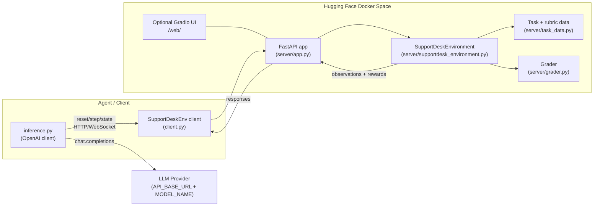

# Support Desk Environment

**OpenEnv environment for realistic B2B support-desk triage.** Agents must investigate internal docs, route the ticket, draft an internal note + customer reply, then submit. Scoring is **deterministic** and normalized to **[0.0, 1.0]**.

**Live Space:** `https://ashwaanthh-supportdesk-env.hf.space` (health: `GET /health`, reset: `POST /reset`)

## Architecture



## What this Hugging Face Space runs

This **Docker Space** hosts the **`supportdesk_env`** OpenEnv server: a **FastAPI** app on port **8000** (see `Dockerfile` and `server/app.py`) built from [`openenv-core`](https://github.com/meta-pytorch/OpenEnv). When the container is healthy you get:

| What | Where / how |
| --- | --- |
| **Health** | `GET /health` → `{"status":"healthy"}` for uptime checks |
| **Environment API** | OpenEnv **`reset`**, **`step`**, **`state`** over HTTP/WebSocket—use the typed Python client [`SupportDeskEnv`](https://huggingface.co/spaces/ashwaanthh/supportdesk-env/blob/main/client.py) (`… .sync()` for synchronous scripts) |
| **Debug UI** | With `ENABLE_WEB_INTERFACE=true`, a **Gradio** control panel is served under **`/web/`** (and `base_path: /web` in this README) |

**What it does (task):** each episode is a fake support ticket. An agent must **select a task**, **search** and **open** internal resources, set **queue / priority / tags / resolution**, **save** an internal note and a customer **reply**, then **submit**. The server grades deterministically; scripted gold trajectories reach a **1.0** ceiling (see **Baselines** below).

**For remote eval or LLM baselines:** point clients at this Space’s public URL (for example `https://ashwaanthh-supportdesk-env.hf.space`) as `ENV_BASE_URL`, or `http://127.0.0.1:8000` when code runs **inside** the same container. Configure LLM API keys as **Space secrets**—see [`docs/HF_SPACE.md`](docs/HF_SPACE.md).

---

`supportdesk_env` is a deterministic OpenEnv environment for B2B SaaS support operations. An agent must inspect a customer ticket, search internal documentation, route the case correctly, draft an internal note, draft a customer reply, and submit a final resolution through the standard `reset()` / `step()` / `state()` interface.

This is meant to feel like real support work rather than a toy benchmark. The three tasks model common operational patterns:

- Easy: password-reset triage with account-access routing
- Medium: billing dispute analysis for an upgrade-related authorization hold
- Hard: enterprise security escalation with billing anomaly handling

## Why This Environment Is Useful

Support triage is a genuine human workflow with clear objectives, partial progress, and multiple failure modes. Good agents need to:

- gather evidence instead of guessing
- set operational metadata correctly
- communicate clearly to the customer
- avoid unsafe promises and policy violations

That makes it a strong fit for both evaluation and reinforcement learning.

## Action Space

The environment uses one typed Pydantic action model: `SupportDeskAction`.

- `select_task(task_id)`
- `search_docs(query)`
- `open_resource(resource_id)`
- `set_priority(priority)`
- `set_queue(queue)`
- `set_tags(tags)`
- `set_resolution_code(resolution_code)`
- `save_internal_note(text)`
- `save_reply(text)`
- `submit()`

Enumerated values:

- Priorities: `low`, `normal`, `high`, `urgent`
- Queues: `account_access`, `billing`, `account_security`, `general_support`
- Resolution codes: `send_reset_link`, `explain_authorization_hold`, `security_escalation`, `request_more_info`

## Observation Space

`SupportDeskObservation` includes:

- `phase`: `task_selection`, `task_workbench`, or `completed`
- `instructions`: current ticket and workflow guidance
- `available_tasks`: visible task cards on reset
- `task_id` and `task_title`
- `resource_catalog`: internal docs and account records available for review
- `open_resource`: full text of the most recently opened resource
- `search_results`: results from the most recent `search_docs` action
- `current_draft`: queue, priority, tags, resolution code, internal note, reply
- `recent_feedback`: environment hints about progress or invalid behavior
- `steps_remaining`
- `score`: current shaped score estimate
- `reward_breakdown`

`state()` returns the public `SupportDeskState`, which tracks the current task, opened resources, search history, draft content, action history, and last score.

## Tasks

### 1. Expired Password Reset Link (Easy)

The user cannot log in because the reset email expired. The correct solution is to route the ticket to `account_access`, keep priority at `normal`, use tags `password_reset` and `login_issue`, set resolution `send_reset_link`, and tell the customer to use a fresh link within 30 minutes while ignoring older reset emails.

### 2. Duplicate Charge After Plan Upgrade (Medium)

The customer thinks they were double charged after upgrading. The environment expects routing to `billing`, priority `high`, tags `duplicate_charge` and `plan_upgrade`, resolution `explain_authorization_hold`, an internal note that cites both invoice IDs, and a reply that distinguishes an authorization hold from a settled charge without promising an immediate refund.

### 3. Enterprise Security Incident With Billing Anomaly (Hard)

An enterprise admin reports unexpected token activity, a seat spike, and billing concerns. The right outcome is queue `account_security`, priority `urgent`, tags `security_incident`, `billing_anomaly`, and `enterprise_sla`, resolution `security_escalation`, and a reply that covers token revocation, security escalation, a billing review freeze, and the one-hour enterprise SLA while avoiding unsafe requests for passwords or premature refund promises.

## Reward Function

The environment computes a deterministic partial score in `[0.0, 1.0]` from:

- evidence gathering from discovered and opened resources
- queue accuracy
- priority accuracy
- tag quality
- resolution code accuracy
- internal note coverage
- reply coverage
- explicit submission completeness

Each step reward is:

```text
reward = current_partial_score - previous_partial_score - action_penalty
```

Penalties apply to invalid actions, repeated no-progress actions, empty saves, and premature submission. This gives dense trajectory feedback instead of a single sparse reward at episode end.

Episodes allow up to **20** environment steps by default so harder tickets can complete (search, multiple document opens, draft fields, submit) without hitting the limit early.

## Layout

```text
.
├── __init__.py
├── client.py
├── compat.py
├── Dockerfile
├── inference.py
├── models.py
├── openenv.yaml
├── pyproject.toml
├── README.md
├── scripted_baselines.py
├── scripts/
│   └── validate_submission.sh
├── docs/
│   └── HF_SPACE.md
├── server/
│   ├── app.py
│   ├── grader.py
│   ├── supportdesk_environment.py
│   └── task_data.py
└── tests/
    ├── test_environment.py
    └── test_grader.py
```

## Setup

### Local Python Setup

```bash
uv sync
```

### Run the official validator (recommended for submission)

This matches the organizer’s 3-step check: Space `/reset` ping, `docker build`, and `openenv validate`.

```bash
PATH="$(pwd)/.venv/bin:$PATH" bash scripts/validate-submission.sh https://ashwaanthh-supportdesk-env.hf.space .
```

### Run Tests

```bash
uv run pytest
```

### Validate the OpenEnv Package

```bash
uv run openenv validate --verbose
```

If you want the OpenEnv CLI to build the same default image tag used by `inference.py`, run:

```bash
uv run openenv build -t supportdesk-env:latest
```

### Build and Run With Docker

```bash
docker build -t supportdesk-env:latest .
docker run --rm -p 8000:8000 supportdesk-env:latest
```

### Connect With the Typed Client

```python
from supportdesk_env import SupportDeskAction, SupportDeskEnv

with SupportDeskEnv(base_url="http://localhost:8000").sync() as env:
    result = env.reset()
    result = env.step(SupportDeskAction(operation="select_task", task_id="task_easy_password_reset"))
    print(result.observation.task_title)
```

## Baselines

### Scripted baseline (reproducible, no API keys)

Gold trajectories in [`scripted_baselines.py`](scripted_baselines.py) replay the same actions pytest uses for smoke tests. This is the fastest way to confirm the grader reaches the ceiling without an LLM:

```bash
uv run python inference.py --scripted
```

| Task | Scripted score |
| --- | ---: |
| `task_easy_password_reset` | 1.00 |
| `task_medium_duplicate_charge` | 1.00 |
| `task_hard_security_incident` | 1.00 |
| **Average** | **1.00** |

### LLM baseline (OpenAI-compatible client)

`inference.py` runs an OpenAI-compatible chat model against the environment in fixed task order with `temperature=0` for reproducibility. Set:

- `API_BASE_URL`
- `MODEL_NAME`
- `HF_TOKEN` or `OPENAI_API_KEY`

Optional: `ENV_BASE_URL` pointing at a running server (recommended for judges and CI). If unset, the client tries `SupportDeskEnv.from_docker_image` using `ENV_IMAGE_NAME` (default `supportdesk-env:latest`).

**Required stdout format for evaluation**: `inference.py` emits exactly `[START]`, `[STEP]`, and `[END]` key=value lines per task as specified by the organizer sample script.

```bash
export API_BASE_URL="https://api.openai.com/v1"
export MODEL_NAME="gpt-4.1-mini"
export OPENAI_API_KEY="..."
export ENV_BASE_URL="http://localhost:8000"
uv run python inference.py
```

Record the printed per-task scores in your submission notes; they depend on the model and provider. Keep `MAX_STEPS` at the default (20) unless you are debugging shorter rollouts.

**Sample LLM baseline** (`Qwen/Qwen2.5-72B-Instruct` via HF Inference Router, `temperature=0`):

| Task | LLM score | Notes |
| --- | ---: | --- |
| `task_easy_password_reset` | — | _pending: fill after running with active credits_ |
| `task_medium_duplicate_charge` | — | |
| `task_hard_security_incident` | — | |
| **Average** | **—** | |

The scripted ceiling is **1.00** on all tasks; LLM scores below that reflect the model's ability to follow structured action schemas, gather evidence before acting, and avoid repetitive searches. Scores are fully deterministic at `temperature=0`.

## Hugging Face Space Deployment

This repository is structured as a Docker Space (`sdk: docker`, `app_port: 8000`). See [`docs/HF_SPACE.md`](docs/HF_SPACE.md) for secrets, health checks, and inference against the deployed URL.

After logging in with the Hugging Face CLI (`hf auth login` or `HF_TOKEN` in the environment), push with:

```bash
uv run openenv push --repo-id ashwaanthh/supportdesk-env
```

**Live Space:** [https://huggingface.co/spaces/ashwaanthh/supportdesk-env](https://huggingface.co/spaces/ashwaanthh/supportdesk-env)

The container sets `ENABLE_WEB_INTERFACE=true`, so a Gradio control panel is mounted at **`/web/`** (with redirects from `/web`). Core OpenEnv endpoints remain:

- `GET /health` — load balancers and automated pings
- WebSocket and HTTP routes for `reset`, `step`, and `state` as provided by `openenv-core` (use the typed `SupportDeskEnv` client rather than calling raw paths)

## Notes

- The environment is fully deterministic. No randomness is used after task selection.
- The hidden rubric is kept server-side only; `state()` exposes operational state but not answer keys.
- The project is designed to run within the target constraint of 2 vCPU and 8 GB RAM.
